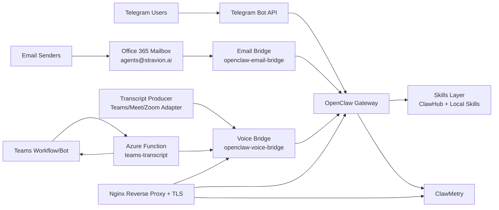
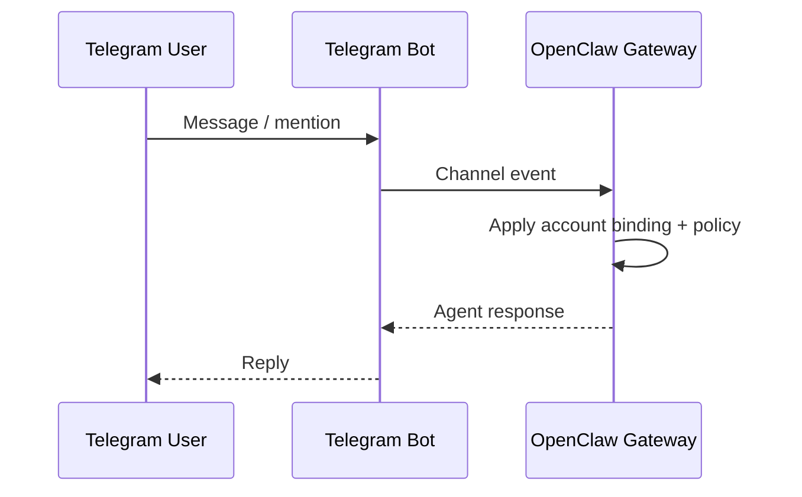
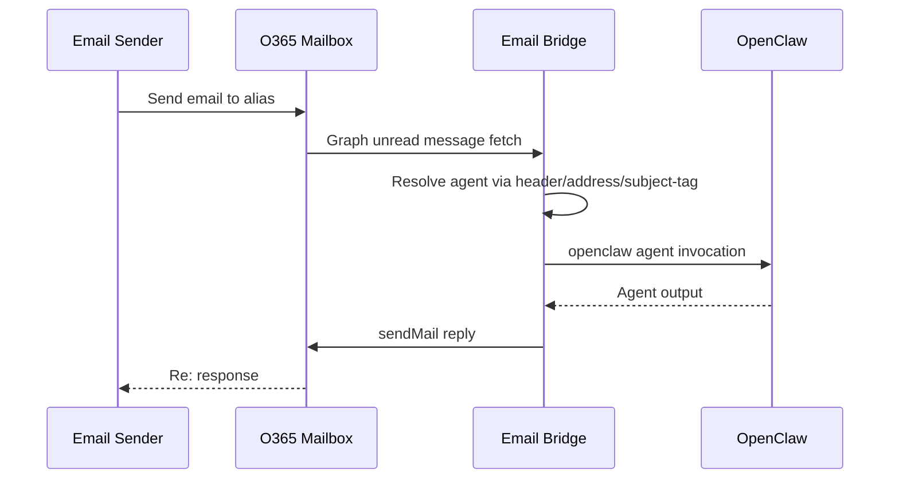
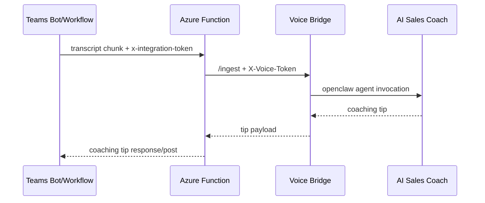

# OpenClaw Technical Architecture

This document describes the production architecture, data flows, security controls, and operational model for this project.

---

## 1) System Overview

The platform is a multi-agent OpenClaw deployment with multiple inbound channels:
- Telegram bots (agent-specific routing),
- O365 email bridge (Graph app-only),
- Voice transcript bridge (token-protected),
- Teams transcript integration via Azure Function.

Primary intent:
- provide non-technical access to specialized agents with secure, auditable operations.

---

## 2) Component Architecture

---

## 3) Runtime Topology

VM-hosted containers:
- `openclaw-screener`
- `openclaw-email-bridge`
- `openclaw-voice-bridge`

Ingress:
- `https://openclaw.proqaai.net` -> Nginx -> `127.0.0.1:18789`
- `https://voice.proqaai.net` -> Nginx -> `127.0.0.1:8787`
- `https://openclaw.proqaai.net/clawmetry` -> Nginx + basic auth -> `127.0.0.1:8900`

Network stance:
- Public inbound expected only on `80/443` (and `22` for admin SSH).
- Application ports bound local where possible and proxied by Nginx.

---

## 4) Agent Model and Routing

Configured agents:
- `main`
- `pre-sales-specialist`
- `sprint-planner`
- `spend-cube-agent`
- `process-mapping-agent`
- `ai-sales-coach`
- `stravy-gtm-agent`
- `ai-cfo`

Routing controls:
- Telegram account-based `bindings` in OpenClaw config.
- Email address mapping (`EMAIL_AGENT_ROUTING`) with subject-tag fallback (`EMAIL_SUBJECT_AGENT_ROUTING`).
- Voice bridge fixed target agent (default `ai-sales-coach`).

---

## 5) Data Flows

### 5.1 Telegram Flow

### 5.2 Email Flow

### 5.3 Voice + Teams Flow

---

## 6) Security Architecture

Controls in place:
- HTTPS termination via Certbot certificates in Nginx.
- Gateway auth token (`OPENCLAW_AUTH_TOKEN`) for UI/gateway access.
- Voice API token (`VOICE_API_TOKEN`) required for ingest and websocket.
- Teams integration token (`INTEGRATION_TOKEN`) on function endpoint.
- Email Graph app scoped to one mailbox with Exchange application access policy.
- Group/ID allowlisting for Telegram access.

Least privilege decisions:
- Graph permissions constrained to `Mail.Read` + `Mail.Send`.
- Email `mark as read` disabled to avoid requiring `Mail.ReadWrite`.
- Processed message IDs cached to avoid duplicate processing.

---

## 7) Observability and Operations

Telemetry and checks:
- Container logs via Docker and compose.
- ClawMetry on `8900` proxied behind basic auth.
- Health checks:
  - OpenClaw: `/`
  - Voice: `/health`
  - Function endpoint request/response logs in Azure.

Operational scripts:
- `bootstrap.sh` for full platform provisioning.
- `hardening.sh` for reverse proxy + auth + firewall posture.
- `scripts/azure_voice_nginx.sh` and `scripts/azure_voice_certbot.sh` for voice domain exposure.

---

## 8) Failure Modes and Resilience

Known failure modes:
- OpenClaw version regressions can block startup under specific model/config combinations.
- O365 alias rewrite can hide original recipient routing metadata.
- Email Graph API may return TNEF/empty body for some internal messages.

Mitigations:
- model fallback and startup checks,
- subject-tag routing fallback,
- synthetic body processing for subject-tagged empty-body messages,
- tokenized and isolated channel bridges.

---

## 9) Capacity and Scaling Notes

Current design is single-VM and single-instance per service.

Scale options:
- Split channel bridges and OpenClaw onto separate hosts.
- Move bridges to container apps or AKS.
- Add queue buffering (Service Bus) between transcript/email ingestion and agent execution for burst handling.
- Introduce centralized secret manager integration for runtime secret injection.

---

## 10) Rebuild Reference

For procedural redeploy from zero, use:
- `docs/rebuild-from-scratch-runbook.md`

For Teams integration implementation details, use:
- `integrations/teams-azure-function/README.md`
